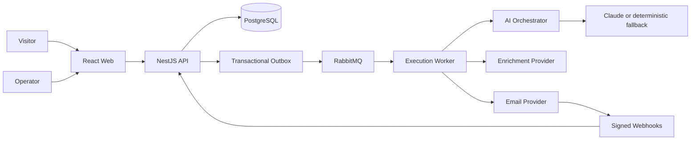

# Architecture

## System Context

Vigil Summit manages the full path from an executive event registration to a confirmed commercial
meeting. The workspace is the tenant boundary and the event is the engagement boundary.

## Boundaries

| Component | Responsibility |
|---|---|
| API | Authentication, RBAC, domain transactions, public actions, privacy, metrics |
| Worker | Outbox publication, enrichment, qualification, durable scheduling, policy, delivery |
| AI orchestrator | Provider isolation, timeouts, typed responses, provider error normalization |
| Web | Registration, funnel operations, provenance, conversation and decision visibility |
| PostgreSQL | Canonical state, idempotency, audit, consent, leases |
| RabbitMQ | At-least-once asynchronous transport with retries and dead-letter queues |

## Registration Flow

1. A published event accepts a validated work registration.
2. A serializable transaction deduplicates the lead, enforces capacity, stores consent, and writes an
   enrichment command to the outbox.
3. The worker enriches and qualifies the lead before any message is eligible.
4. A cadence enrollment and scheduled actions are persisted.
5. At decision and delivery time, policy verifies consent, suppression, registration state,
   meetings, quiet hours, and frequency limits.

## Reliability

- Unique idempotency keys protect registrations, outbox events, scheduled actions, message events,
  and provider webhooks.
- Scheduled actions use atomic claims and expiring leases; failed actions retry with bounded backoff.
- RabbitMQ consumers use dedicated retry queues and dead-letter routing.
- Provider adapters are replaceable and local adapters are deterministic.
- Business state never depends on RabbitMQ retaining a message.

## Agent Governance

The model drafts or classifies within a closed context. Deterministic code owns eligibility,
transitions, consent, suppression, cadence, and meeting confirmation. Every decision records the
model, prompt version, context hash, policy result, reason codes, rationale, and output reference.

## Scale

Workspace and event IDs are carried through all state and messages. Horizontal workers claim work
through database leases and RabbitMQ acknowledgements. Ten simultaneous events require worker
replicas and provider quotas, not new domain services. PostgreSQL indexes cover tenant, event,
status, due date, and idempotency paths.
