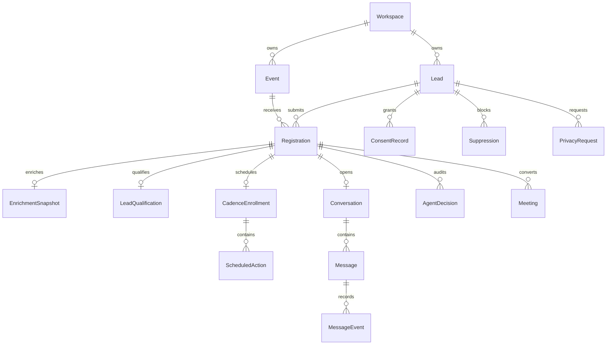

# Data Model

Declared, enriched, observed, and inferred signals remain distinct. Operational data is scoped by
workspace and event. Registration status is the funnel state; message delivery does not imply
attendance, and only a `BOOKED` meeting counts as a commercial conversion.
